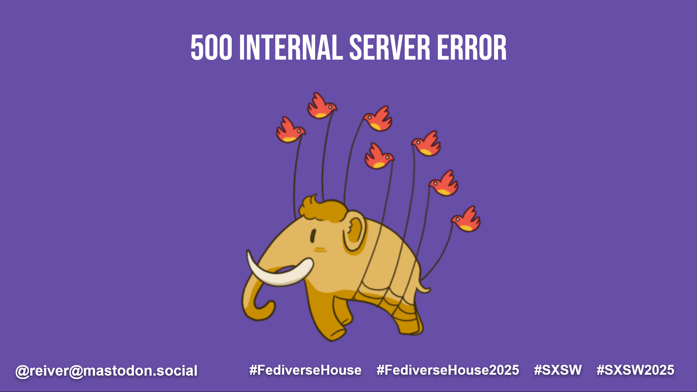
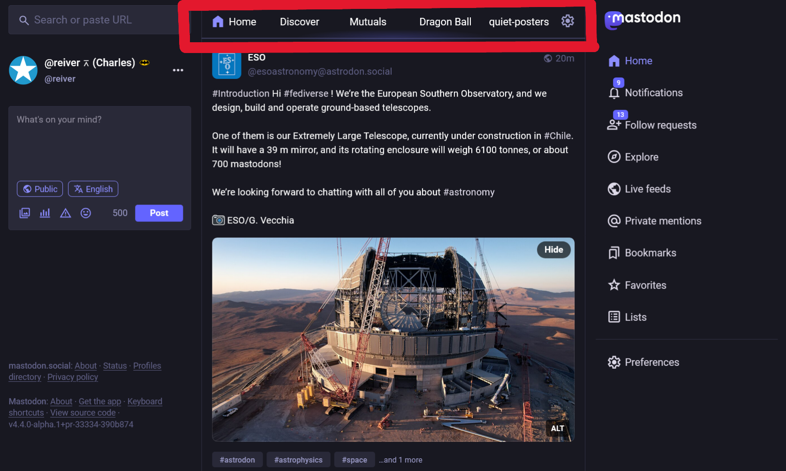
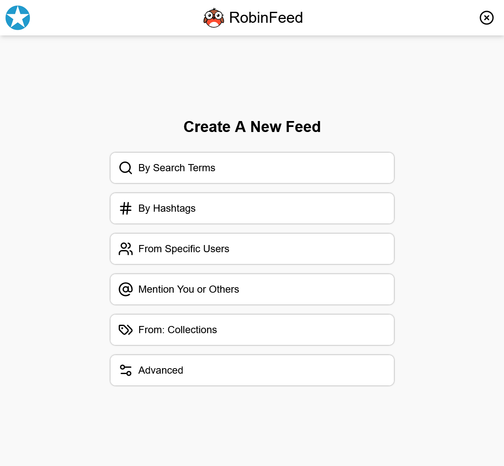
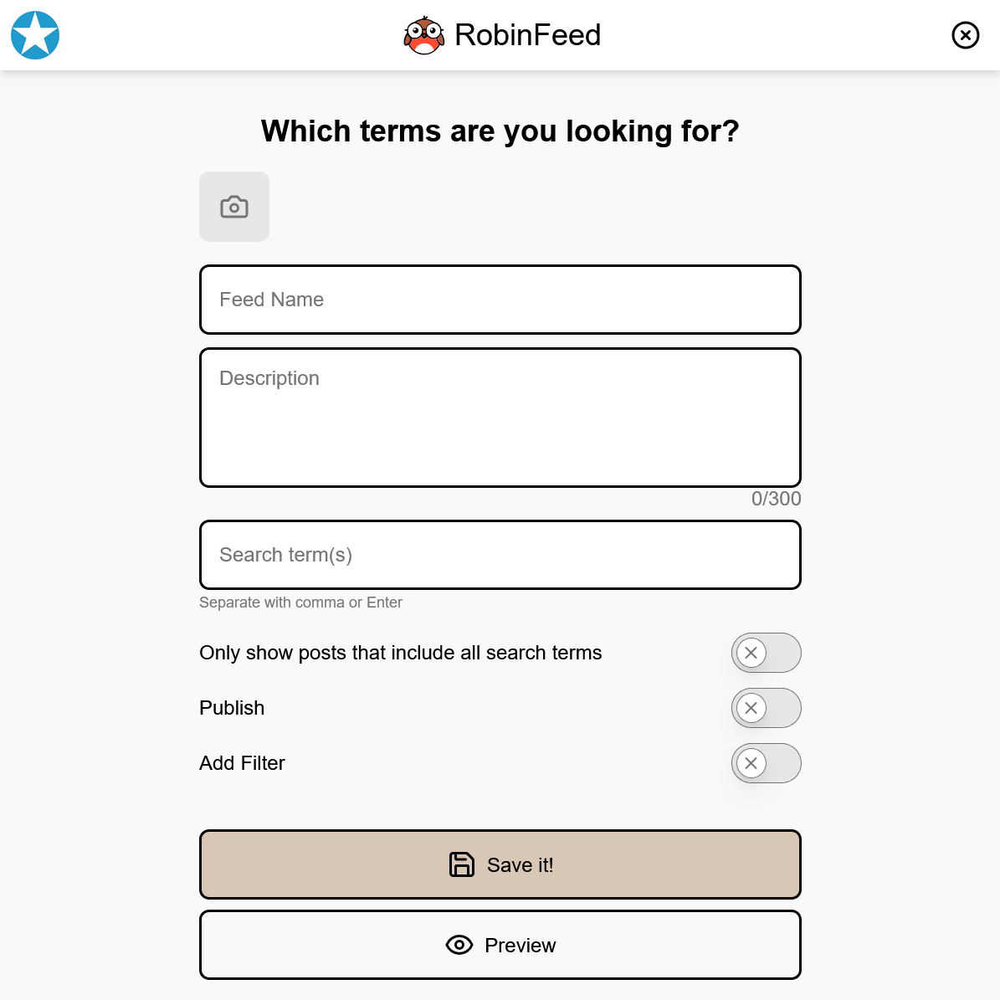
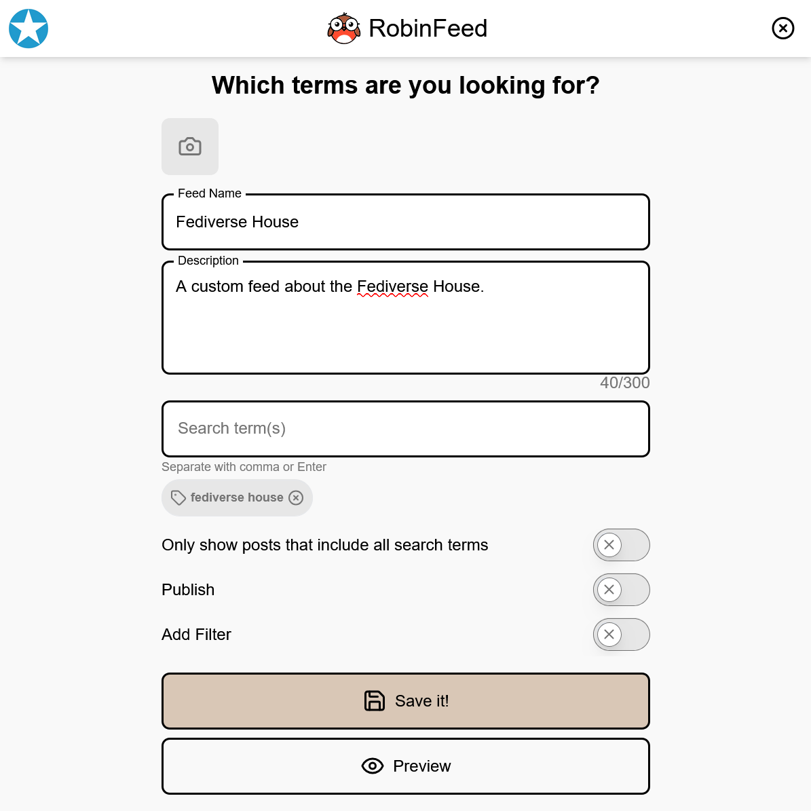
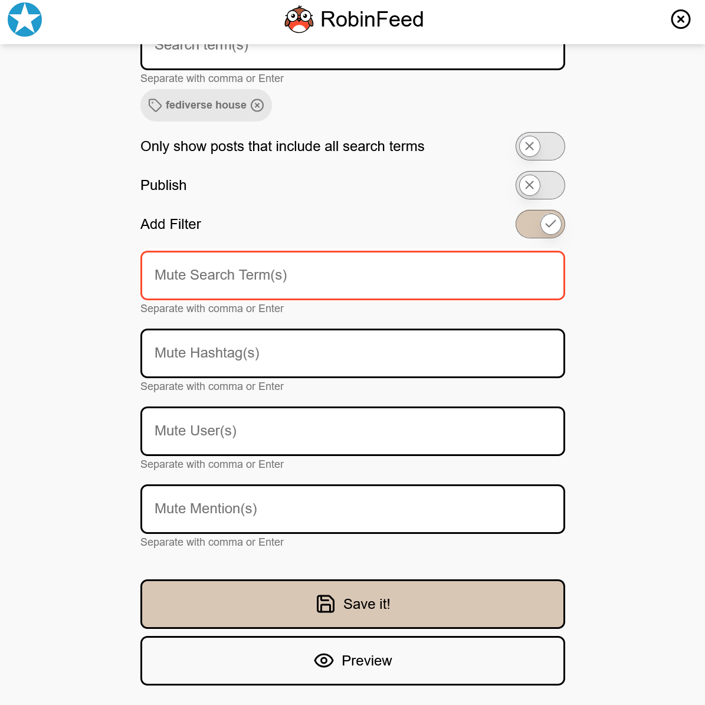
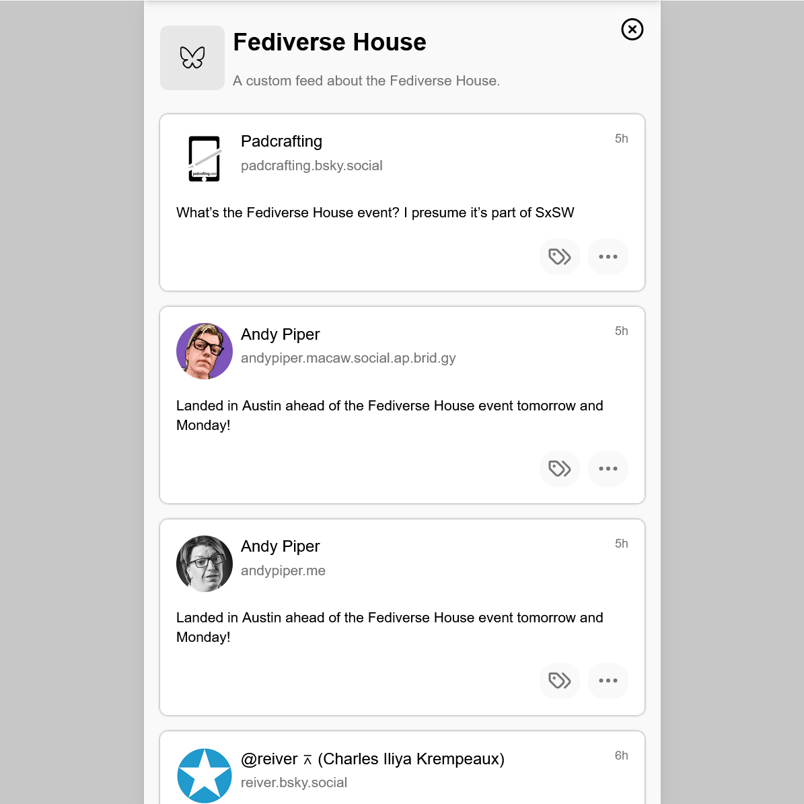

# Hosting the Fediverse: The Unexpected Lesson from SpaceHost

The best presentations _tell a story_ — this is a story of our journey **hosting the Fediverse** at [SpaceHost](https://spacehost.one):

* What we tried first.
* How & why that failed.
* How we solved the problem.
* And, an unexpected _invention_ that could _reshape the Social Web_.

If you care about the Fediverse, then _this is a story for you_.

<mark>NOTE: This article is a written adaptation of the presentation I delivered at the **Fediverse House** during **SXSW 2025**.</mark>

But — a story needs a _beginning_.
So, I will start with an _introduction_.

## Who Am I

I am **Charles Iliya Krempeaux**.

I have been a **product leader**, an **engineering leader**, and a **founder**.

But, I will skip the _long bio_ — here is _just one_ highlight from my career:

**I was one of the first engineers** at **Hootsuite**
—
a **social-media** company which at one time **the most popular Twitter app** in the world.
Over time, Hootsuite expanded to _also_ became a **Facebook**, **Google+**, **Instagram**, **LinkedIn**, **TikTok**, **YouTube**, **WhatsApp**, and _every other social-media platform_ app.
Everyone from
the U.S. White House,
to IBM,
to tens-of-millions of people all over the world,
and 80% of fortune 1,000 companies
have used the tool I created with others.

I have _been in Tech_ for **_more-than_ 30 years**.

And, from **engineering**, to **product**, to **enterprise**, and to **company** — I have **a lot** of **experience** with **social-media**.

## Me on the Fediverse

Some of you might know _me_ from — **_The Fediverse_**!
From my [`@reiver@mastodon.social`](https://mastodon.social/@reiver) account.

Where I talk **a lot** about — _you guessed it_ — **the Fediverse**.
I _also_ talk about _other_ **decentralized social-media** (**DeSo**) — including **Bluesky**, **Farcaster**, **Nostr**, and others.

And, I talk about **the Fediverse related projects** I work on, too.
For example…

## GreatApe

… GreatApe!

[GreatApe](http://greata.pe/) is a conversations platform for the Fediverse, and decentralized social-media.

Here is an _example_ of _myself_ and [`atomicpoet`](https://atomicpoet.org/@atomicpoet) (Chris Trottier) using GreatApe back in October 2023.

Here, we were using GreatApe to do a **live video podcast**.

Now, you don't see it in this image, but — we can also _invite_ people _watching_ in the _audience_ to _join the video conversation_.

## SpaceHost

_Another thing_ some people _might know me from_ is — [SpaceHost](https://spacehost.one/).

And, for _this story_ — **SpaceHost** is probably the _more important thing_ — as it _partially motivates_ what I am _soon_ going to show you.

## What Is SpaceHost

**But, what is SpaceHost** —

We need to know this for the story.

**What is SpaceHost** —

To _regular people_, I tend to **describe SpaceHost as** —

> **SpaceHost is an _app-directory_ for the _Fediverse_**

Or maybe –-

> **SpaceHost is an _app-directory_ for the _decentralized social-media_**

To people who are a little more _tech savvy_ — I might describe SpaceHost as —

> **SpaceHost is _fully-managed hosting_ for _all the Fediverse_**

As far as I know –

* SpaceHost was **the second hosting-company in the Fediverse**, after Masto.Host, and
* SpaceHost is **the first hosting-company in the Fediverse to _try to_ offer _all the (other) Fediverse software other than Mastodon_** –  although, we _also offer Mastodon_.

## What Crashes Fediverse Servers

We _learned_ a number of things from _our experience_ with hosting so many people’s _Fediverse servers_.
Here is **_one thing_ we learned** —

We learned what _seems to be the **number 1 cause** of Fediverse servers crashing_ — including **Mastodon**, **Misskey**, **Pixelfed**, and every other type of Fediverse server.

Before you read what that is – guess to yourself what _you think_ it might be.

(**Scroll down once you have your guess.**)

Here is the answer —

**Caching**

And, in particular —

**The _storage drive_ of _Fedivere servers filling-up_ – due to _continued caching_**.

## Caching

Some of you might ask — 

* **What is being _cached_**?
* Some of you might even be ask, **what is _caching_**?

Those are both _good questions_ 🙂

**Caching** is a _technical term_ — in _computer science_, _computer hardware engineering_, and _software engineering_.
It (caching) basically means — **temporarily storing things**.

So, _what_ is being _temporarily stored_?

With _Fediverse servers_, they _temporarily store_ **user-data from other servers**.

* posts,
* media from posts,
* user-profile text,
* avatar images,
* header images,
* _and more_.

Now, _temporarily storing_ things (_caching_) is normal.

It (caching) is a _core technique_ with _computer programming_ & (other) _engineering_ –

Everything from **the CPU** to **the Web**, to **applications** all cache.
And, would _not_ work without caching.

So – _caching_ is _important_, _caching_ makes things _work_, but – _caching_ is a _difficult_ to _do well_.

So – it is _not_ surprising that _caching_ is _challenging_ for _Fediverse servers_ to do well.

## Round One

At SpaceHost we wrestled with this problem.

Should we _just automatically clear the cache_ for our customers?

Or, should we _tell them_ their _storage drive_ is filling up – and, _let them decide_.

The challenge is – _clearing the cache_ affects _user-experience_.
It can “break” search.
It can also "break" the home-feed.

So –

At first – we decided to just _e-mail_ our _customers_ to _tell them_ that _their storage drives_ were _filling-up_ and _let then decide_.

What we found-out was that –

**Most customers _seemed to never notice_ the _e-mail alert_ we sent them!**

In hindsight, that _was not_ a good strategy.

So –

## Round Two

This was a problem!

It created a _bad experience_.

Their server got _slow_.
And sometimes _crashed_.

It doesn't matter if we sent them an e-mail or not.
It wasn't being noticed.
And, they were _unhappy_.

Which made us unhappy.
We wanted to fix this.
So –

We changed _our strategy_.

We started _automatically clearing_ our customers _caches_.

This is _better-than_ _servers crashing_, but – there is still a problem –

## Round Three

Search is _sort of_ _broken_ for them.

So –

We need to _separate_ **search** from the **back-end server**.

We need to make it so **accumulating user-data** doesn’t **crash** the **back-end**. 

In fact – multiple **back-end servers** could **share** the same **search-server** to _reduce costs_.

We also need a **_Fediverse API_ for _search_**.
(More on that in a future article.)

Here is the thing – **we already built a lot of it**.

We started working on this back in August 2024.

In fact – we start working on **search** plus **custom feeds** back in August 2024.

I didn’t mentioned **custom feeds** yet, but I am mentioning it now.

But back to **search** –

## RobinLive

Because no **Fediverse software** uses this **search API** yet –

We created a **real-time search-engine** (named [RobinLive](https://robin.live/)) so you can see it _in action_.

You can try it for yourself at:

https://robin.live/

## Decentralized Search

Now, although [RobinLive](https://robin.live/) exists – the idea is that there would be _multiple_ **search-servers**.

And, not just RobinLive.

That is right – **let's decentralize them**.
**Let's decentralize search**!

RobinLive will be _one of many_.

**It is difficult to overstate the significance _decentralized search_**
–
not only for the Social Web but for the (classical) Web and the Internet as a whole.
Decentralization will be just as transformative for _search_ and the Web as it has been for social-media.

## DeSo Search

If you were looking closely at the _previous_ RobinLive screen, you might have noticed that – in addition to showing results from the Fediverse – we were also showing results from Bluesky.

We on the Fediverse have more in common with those on _other decentralized social-networks_ than the _centralized ones_.
I don't think we are enemies.
I think we are all fellow-travelers.
We are all reacting to the same problems (with the Internet, the Web, and social-media) in a similar way — we are just choosing different technologies.

I have my own opinions about the Tech.
I have my own preferences.
But –

I want **the user** to **_not_ have to care about** _these differences_.

## All The DeSo Networks

I think [Danielle Foré](https://mastodon.online/@danirabbit) [said it](https://mastodon.online/@danirabbit/113919277314661343) best –

When talking about **the Fediverse** – she didn’t say "_decentralized_", or "_open-source_", or "_server_", or even mention "_e-mail_".
She just said –

> you can _follow anyone_ from any _social-network_.

**I want to make that _as true_ as I can.**

Thus – users **should not care** about _the differences between_ – the Fediverse, Bluesky, Nostr, and others.

## Custom Feeds

I also mentioned – **custom feeds**.

I have been _talking about_ and _meme'ing about_ **Fediverse custom feeds** for a while – and thinking about them _even longer_.

And, guess what – we already built a lot of that, too.

In fact — the technology for **real-time search** and **custom feeds** are related.

## What Are Feeds

The **feed** most people are probably familiar with is – the **home-feed**.

On **Mastodon**, the _home-feed_ uses a **simple algorithm** – **reverse chron**.
This (_reverse chron_) is what some people _inaccurately_ call "**_no algorithm_**".

A **custom feed** lets you pick an **_alternative_ algorithm** to this.
For example –

What if you wanted a _feed_ that – _only showed_ posts from _people you follow_ _who do not post very often_.
(This was a 3rd party app for Twitter decades ago.)

What if you are a parent and want a _feed_ for you child that – shows posts from the people your child follows, but – removes all posts that contain pornographic images.

What if you want a _feed_ – that _only shows_ posts from _mutuals_.

What if you are a cat lover and follow a bunch of (other) people who post photos of cats but also post stuff unrelated to cats that you do not care about, and want a _feed_ that – _only shows_ posts from the _people you follow_ that includes a photo of a cat.

What if you are a scholar, and you want a _feed_ that _only shows_ scholarly papers shared by people you follow.

What if you use your community as a human-powered recommendation engine, and want a feed that – shows popular posts and links drawn from the various communities you are in.

Etc.

## RobinFeed

This is [RobinFeed](https://robinfeed.com/) – **RobinFeed** is a **custom feed generator**.

RobinFeed actually already has users — people are already using RobinFeed!

Here (in the previous screenshot) are RobinFeed’s _current_ choices for creating a **custom feed**.
(More options will be available in the future.)

There is a saying:

> Show, don't tell.

So I am going to show you some of what RobinFeed is like – if you were to choose the `"By Search Terms"` button (in the previous screenshot), you would then see the following –

Here (in this screenshot), RobinFeed lets you choose what **search terms** you want to base your **custom feed** on.
(Again, there are other ways of creating a _custom feed_, but — in this demo I am taking you through just one of them.)

I can fill this form in as follows (in the following screenshot) to get the following –

Here I am just made making RobinFeed search for `"fediverse house"`.

I can also **filter-out** things by choosing `"Ad Filter"` –

But, I will leave that empty _for this demo_.

(BTW, one upcoming filter we plan to add to RobinFeed is — the ability to detect and filter-out pornographic images. Something that can help people create both _child-safer_ and _work-safer_ feeds.)

## Bluesky Custom Feeds

We turned the _Fediverse results_ in [RobinFeed](https://robinfeed.com/) off, _just for now_.

Pressing the _preview_ button currently only shows results from Bluesky.
(Although, by the time most people read this, **RobinFeed** **Fediverse custom feeds** may have been turned back on.)

Again – Fediverse results are in the system.
You can see them in the real-time search-engine – [RobinLive](https://robin.live/)

But –

## Fediverse Custom Feeds

Before the Fediverse can have its own **custom feeds**, we need something from Fediverse developers – from the people who build the Fediverse.

The Fediverse needs front-end application support for **Fediverse custom feeds**, as a user-experience.
The Fediverse needs front-end application support for ActivtyPub `"Feed"` sub-actor-type (of `"Application"`), as a way of encoding Fediverse custom feeds.

Which means – I have _more_ work to do, and I need to have more conversations with more Fediverse developers, to make this happen.

And – I will end this here.

## Thank You

Thank you for reading all of that.
To summarize:

You can try the real-time search-engine at:

* https://robin.live/

Hopefully, there will eventually be other search-engines like it – so that we can **decentralize search**.

And – although _more work needs to be done_ to support _Fediverse custom feeds_ –

You can try out the **custom feed generator** at:

* https://robinfeed.com/

And – if you want to take a look at what motivated this story – you can give **SpaceHost** a try at:

* https://spacehost.one/

If you would like to _talk to me more_ about any of this, or just want to _follow along_ – you can **follow me at** –

* [`@reiver@mastodon.social`](https://mastodon.social/@reiver)

-----

<mark>**Thank you** [Evan Prodromou](https://cosocial.ca/@evan) for letting me present at the **Developer Meetup** at the **Fediverse House** at **SXSW 2025**.</mark>
